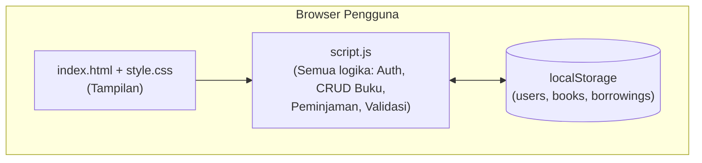
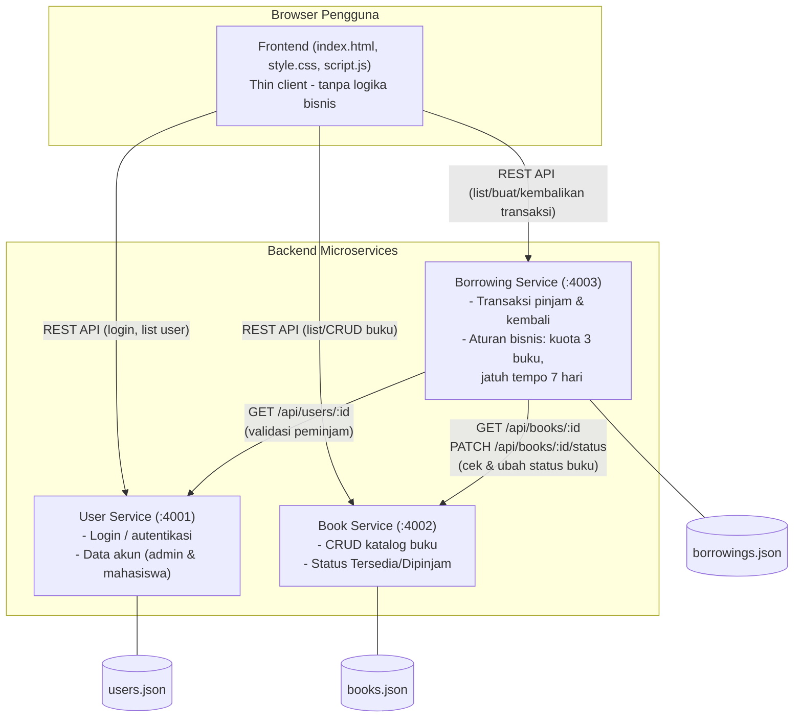
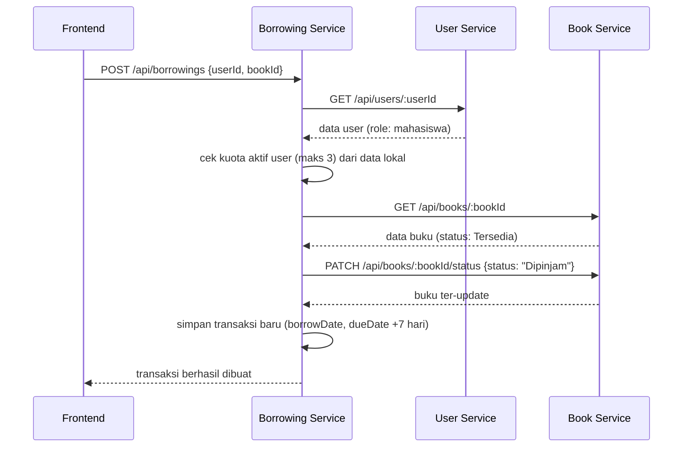

# Diagram Arsitektur

## Sebelum (Monolith - Client Side Only)

Proyek sebelumnya adalah aplikasi **client-side murni**: satu file HTML, satu file CSS,
dan satu file JavaScript. Semua "database" disimpan di `localStorage` browser, dan seluruh
logika bisnis (validasi kuota 3 buku, jatuh tempo 7 hari, CRUD buku, dsb.) dijalankan di
dalam `script.js` yang sama, tidak ada backend maupun API sama sekali.

**Masalah pendekatan lama:**
- Data hanya tersimpan di satu browser satu perangkat (tidak bisa dipakai bersama banyak pengguna/perangkat sungguhan).
- Tidak ada pemisahan tanggung jawab: satu file JS menangani autentikasi, katalog buku, dan transaksi sekaligus.
- Tidak ada API yang bisa dipakai ulang oleh aplikasi lain (mis. aplikasi mobile).

## Sesudah (Microservice)

Aplikasi dipecah menjadi **3 microservice independen**, masing-masing dengan database
(file JSON) miliknya sendiri, berkomunikasi lewat REST API (JSON over HTTP). Frontend
menjadi *thin client* yang murni memanggil API dan menampilkan hasilnya.

**Alur fitur utama yang melibatkan lebih dari satu service (contoh: Mahasiswa meminjam buku):**

Alur pengembalian buku (`PATCH /api/borrowings/:id/return`) mengikuti pola yang sama:
Borrowing Service memvalidasi transaksi, lalu memanggil Book Service untuk mengembalikan
status buku menjadi `Tersedia`.

### Mengapa dipisah seperti ini?

| Service | Alasan dipisah |
|---|---|
| **User Service** | Domain akun/identitas berbeda dari domain buku maupun transaksi; ke depannya bisa dikembangkan jadi service autentikasi terpusat (SSO) tanpa mengubah service lain. |
| **Book Service** | Katalog buku adalah *master data* yang dipakai baik oleh Pengurus (CRUD) maupun Mahasiswa (baca), dan menjadi satu-satunya pemilik status ketersediaan buku. |
| **Borrowing Service** | Berisi aturan bisnis paling kompleks (kuota, jatuh tempo) dan paling sering berubah seiring aturan perpustakaan berubah, sehingga baik dipisah agar perubahan di sini tidak berisiko merusak data katalog atau akun. |
